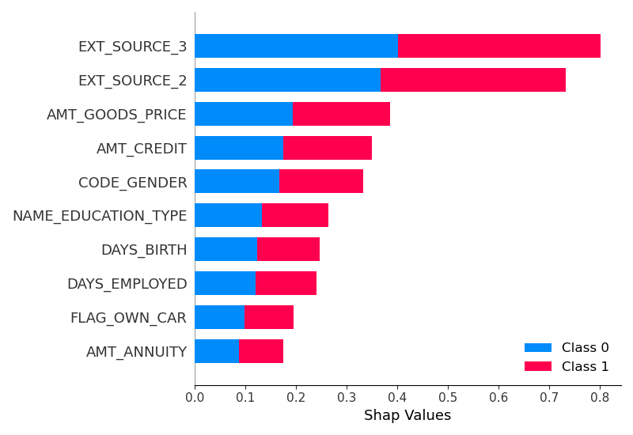

# Home-credit
 

## Description du projet
 

L’entreprise souhaite mettre en œuvre un outil de “scoring crédit” pour calculer la probabilité qu’un client rembourse son crédit, puis classifie la demande en crédit accordé ou refusé. Elle souhaite donc développer un algorithme de classification en s’appuyant sur des sources de données variées (données comportementales, données provenant d'autres institutions financières, etc.).

De plus, les chargés de relation client ont fait remonter le fait que les clients sont de plus en plus demandeurs de transparence vis-à-vis des décisions d’octroi de crédit. Cette demande de transparence des clients va tout à fait dans le sens des valeurs que l’entreprise veut incarner.

Prêt à dépenser décide donc de développer un dashboard interactif pour que les chargés de relation client puissent à la fois expliquer de façon la plus transparente possible les décisions d’octroi de crédit, mais également permettre à leurs clients de disposer de leurs informations personnelles et de les explorer facilement. 
 

## Fonction coût métier
 

J'ai créé un fonction coût métier qui prend en compte qu'un faux-négatif coûte 10 fois plus qu'un faux-positif. On va donc créer une fonction score qui augmentera de 10 par faux-négatif et de 1 par faux-positif. L'objectif sera de minimiser cette fonction score. On prendra aussi en compte le score AUC et le temps d'entrainement du modèle.

Je vais utiliser la fonction make_scorer de sickit-learn afin de pouvoir utiliser ce score dans la fonction RandomizedSearchCV pour optimiser les hyperparamètres des modèles que je vais entrainer.

Pour otpimiser le threshold, j'ai également créer une fonction qui en prendra en paramètres les probabilités prédient par le modèle et les classes réelles. Cette fonction, retournera le seuil qui permet d'optimiser le coût métier créé.
Pour cela, elle testera toutes les possibilités de 0 à 1 avec une marche personalisable et retournera celui permettant d'avoir le coût minimum.
 

## Entrainement du modèle
 

Dans un premier temps j'ai nettoyé les données grâce à un script récupéré de kaggle. 
Tout le crédit revient à Arezoo Dahesh

Les algorithmes utilisés sont:
    - XGBoost
    - LightGBM
    - LogisticRegression
    - AdaBoost

J'ai aussi utilisé un DummyClassifier pour comparer les modèles utilisés à un modèle naif.

Pour chaque modèle sauf pour la régression logistique on va passer par un RandomizedSearchCV pour trouver les hyperparamètres qui permettront d'optimiser la fonction coût.

Je dispose d'un jeu de donnée d'entrainement et d'un jeu de donnée de test (qui ne contient pas les target). Je vais donc passer par des cross_validation (grâce au cross_val_predict de sickit-learn par exemple) pour entrainer et tester les modèles.

LightGBM est le modèle qui permet d'obtenir les meilleurs scores, c'est donc avec lui que j'ai testé les différentes méthodes de sampling pour optimiser encore le score. 

 

 

## Le traitement du déséquilibre des classes
 

Pour traiter le déséquilibre des classes on va utiliser différentes méthodes de sampling.

    - SMOTE
    - OverSampling
    - UnderSampling

LightGBM est le modèle qui permet d'obtenir les meilleurs scores, c'est donc avec lui que j'ai testé les différentes méthodes de sampling pour optimiser encore le score. 

SMOTE permet de créer de nouvelles lignes correspondant à la classe minoritaire en utilisant la méthode des plus proches voisins.
L'oversampling duplique des lignes de la classe minoritaire aléatoire pour rééquilibrer et l'undersampling supprime des lignes de la classes majoritaire.

On va comparer ces différentes méthodes à simplement passer le paramétre 'class_weight : balanced' qui permet de donner un poids supérieur à la classe minoritaire qu'a la classe majoritaire.

 

 

## L’interprétabilité globale et locale du modèle 
 

 

Pour faire l'interprétabilité globale du modèle on va utiliser la librairie shap. 

Ce qu'on voit c'est que les features les plus importantes sont plutôt des métriques métier qui ne sont pas forcément interprétable pour nous.

Pour l'interprétabilité locale on va plutôt utiliser la librairie Lime qui est plus adaptée. On peut voir que certaines features
 

## L’analyse du Data Drift

 

J'ai analysé grâce à la librairie Evidency le data drift entre les données de train et les données de test pour vérifier que les données sur lesquelles on va entrainer notre modèle sont les plus similaires possibles au données de test.
Le rapport présent dans le dossier montre bien qu'il n'y a pas de data drift présent entre notre jeu de donnée d'entrainement et de test.

